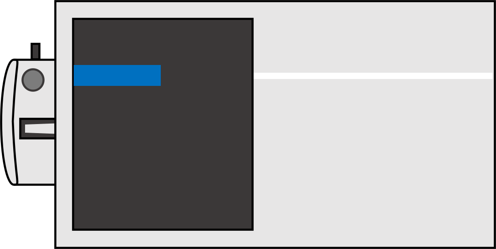
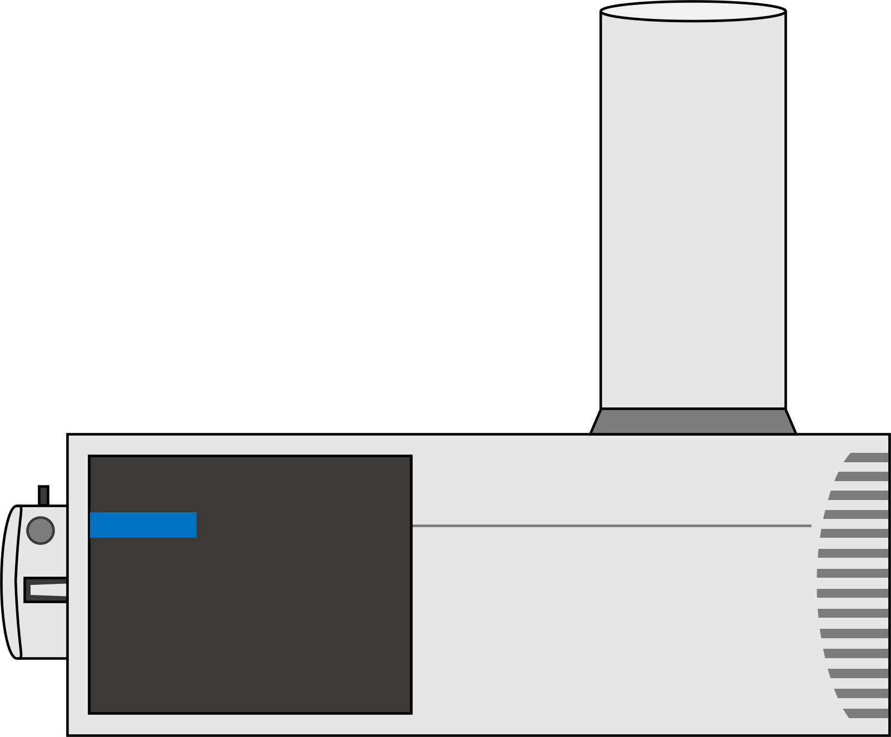
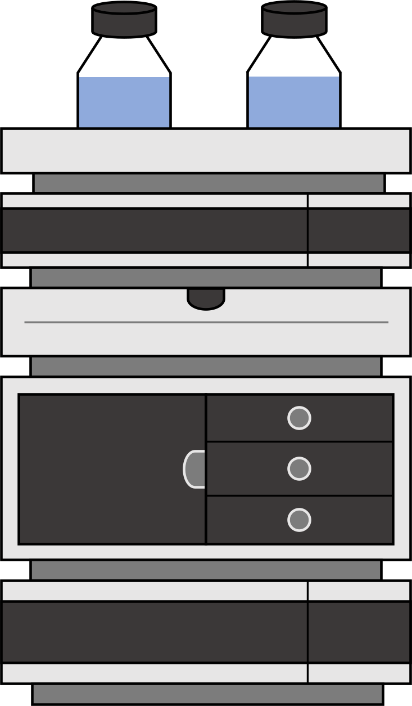
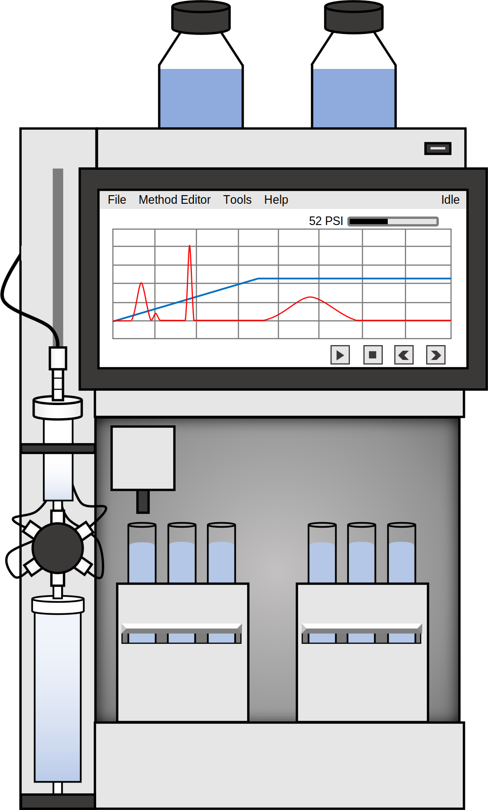
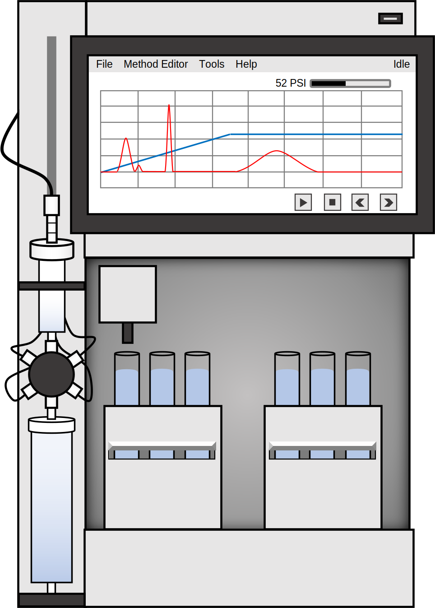
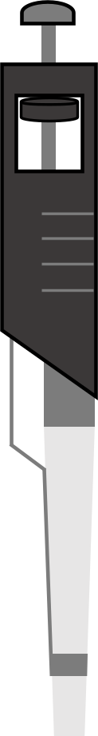
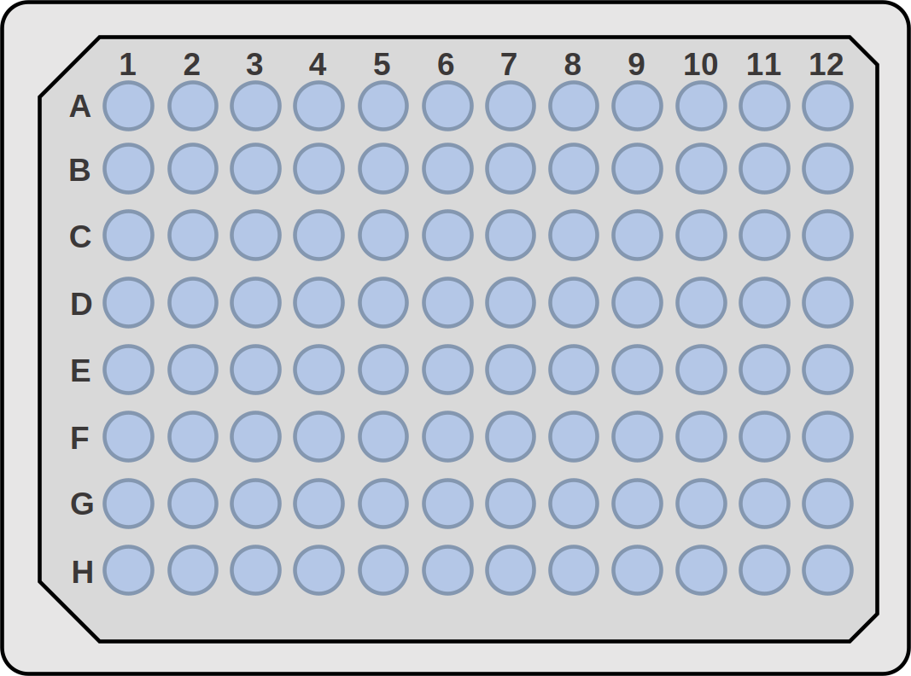

# Chemistry-icons

This repository contains a small set of handmade SVG/png icons for chemistry/biology. These icons can be used freely in any scientific production, including papers, presentations and reports. This repository has been created to meet chemists' needs in the design of their figures/schemes by avoiding the use of websites which may include subscription fees or citing sources.

Currently, a very small set of icons related to laboratory equipment is available. However, this repository will be updated gradually.

## Icons available

 
 
